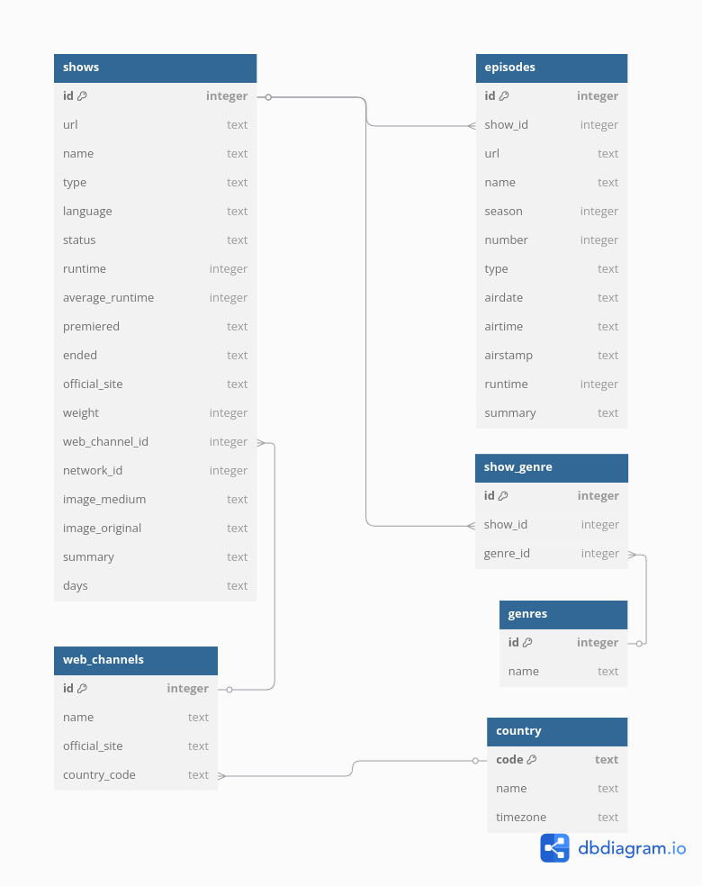

# Prueba Técnica Data Engineer ETL TVmaze

Este proyecto es una prueba técnica para el cargo de Data Engineer donde se realizan operaciones de extracción, transformación y carga (ETL) de información sobre shows de TV emitidos por web/streaming durante enero de 2024, haciendo uso de la API de TVMaze.

## Descripción del proyecto

Este proyecto implementa un pipeline ETL completo dentro de un entorno controlado y aislado mediante Docker, con Poetry para la gestión de dependencias y Makefile para simplificar la ejecución de comandos.

## Objetivo Principal
Recopilar, procesar y analizar datos de series de TV emitidas por web/streaming durante enero de 2024 a través de la API de TVmaze.

## Tecnologías utilizadas
| Componente | Tecnologías |
|-----------|-------------|
| Entorno | Docker, Poetry, Makefile |
| Lenguaje de Programación | Python |
| Extracción | Requests |
| Perfilado de Datos| ydata-profiling |
| Transformación| Pandas |
| Almacenamiento | Parquet (compresión Snappy), JSON, SQLite |

## Estructura del proyecto

```
prueba_tecnica_data_engineer_etl_tvmaze/
│
├── 📁 data/                              # Almacenamiento de datos procesados
│
├── 📁 db/                                # Base de datos SQLite y archivos relacionados
│
├── 📁 json/                              # Archivos JSON resultantes
│
├── 📁 model/                             # Modelos de datos
│
├── 📁 profiling/                         # Informe y análisis de perfilado de datos
│
├── 📁 src/                               # Código fuente principal
│   │
│   ├── 📁 tests/                         # Pruebas unitarias
│   │   ├── 📄 mock_response.json         # Datos simulados para pruebas
│   │   ├── 📄 test_extraction.py         # Pruebas para el módulo de extracción
│   │   ├── 📄 test_load.py               # Pruebas para el módulo de carga
│   │   └── 📄 test_transform.py          # Pruebas para el módulo de transformación
│   │
│   ├── 📄 analysis.py                    # Análisis de datos y generación de métricas
│   ├── 📄 extraction.py                  # Módulo para extraer datos de la API
│   ├── 📄 load.py                        # Módulo para cargar datos procesados
│   ├── 📄 main_etl.py                    # Punto de entrada principal del pipeline ETL
│   └── 📄 transform.py                   # Módulo para transformar datos
│
├── 📄 .gitignore                         # Archivos y directorios ignorados por Git
├── 📄 Dockerfile                         # Configuración del contenedor Docker
├── 📄 Makefile                           # Comandos para automatizar tareas
├── 📄 poetry.lock                        # Bloqueo de dependencias específicas
└── 📄 pyproject.toml                     # Configuración del proyecto y dependencias
```

## Instalación

### Prerrequisitos

Antes de instalar el proyecto, asegúrate de tener las siguientes herramientas en tu sistema:

| Herramienta | Función | Obligatorio |
|-------------|---------|-------------|
| [Docker](https://docs.docker.com/get-docker/) | Contenedorización | ✅ |
| [Make](https://www.gnu.org/software/make/) | Automatización | ⭐ Opcional |

> **Nota**: Make es opcional pero recomendado para simplificar los comandos. Se proporcionan alternativas con Docker puro.

### Pasos de Instalación

#### 1️⃣ Clonar el repositorio

```bash
git clone https://github.com/LudovicaMorales/prueba_tecnica_data_engineer_etl_tvmaze.git

cd prueba_tecnica_data_engineer_etl_tvmaze
```

#### 2️⃣ Construir la imagen de Docker

**Con Make** (recomendado):
```bash
make build
```

**Solo con Docker**:
```bash
docker build -t prueba_tecnica_data_engineer_etl_tvmaze:latest .
```

#### 3️⃣ Ejecutar el proyecto

**Con Make** (recomendado):
```bash
make run
```

**Solo con Docker**:
```bash
docker run --rm -it -v $(PWD):/app --name prueba_tecnica_data_engineer_etl_tvmaze prueba_tecnica_data_engineer_etl_tvmaze:latest
```

### Verificación

Tras ejecutar estos comandos, el proyecto comenzará automáticamente a:

- Extraer datos de la API de TVmaze
- Transformar la información 
- Cargar los resultados en las ubicaciones correspondientes

Los archivos generados estarán disponibles en las carpetas `/json`, `/data`, `/db` y `/profiling` de tu directorio local.

### Comandos Adicionales

| Comando | Descripción |
|---------|-------------|
| `make shell` | Abre la terminal|
| `etl` | Ejecuta todo el flujo de la ETL|

## Descripción del código

#### 1️⃣ Extracción (`extraction.py`)
- Realiza peticiones HTTP a la API de TVmaze para cada día de enero 2024
- Obtiene información de shows emitidos en plataformas web/streaming
- Almacena las respuestas en archivos JSON para procesamiento posterior

#### 2️⃣ Transformación (`transform.py`)
- **Carga inicial**: Lee todos los archivos JSON y los unifica en un DataFrame de pandas
- **Limpieza de datos**:
  - Estandarización de nombres de columnas y formatos de fecha
  - Eliminación de HTML en campos de texto como resúmenes
  - Descarte de columnas con >85% de datos faltantes
  - Filtrado de registros específicos (ej: temporada 2024)
  - Imputación de valores numéricos faltantes usando la mediana
  - Imputación de valores categóricos faltantes usando la moda
  - Normalización de listas (géneros, días de emisión) a cadenas separadas por comas
  - Mapeo de días de la semana a números para facilitar análisis
  - Normalización de categorías poco frecuentes
  - Eliminación de filas con <25% de datos completos
  - Eliminación de duplicados

#### 3️⃣ Análisis (`analysis.py`)
- Generación de perfiles de datos con `ydata-profiling` exportados en HTML
- Cálculo de métricas clave:
  - Runtime promedio de episodios
  - Distribución de shows por género
  - Listado de dominios de sitios oficiales

#### 4️⃣ Carga (`load.py`)
- **Almacenamiento en Parquet**: 
  - Exportación eficiente con compresión Snappy para análisis rápido
  - Guardado en `/data` para acceso posterior
- **Base de datos SQLite**: 
  - Creación de esquema relacional normalizado
  - Carga de datos procesados en tablas estructuradas
  - Almacenamiento en `/db` para consultas SQL

## Modelo de Datos

El modelo relacional implementado está diseñado para capturar y organizar eficientemente toda la información de programas de televisión obtenida desde la API de TVmaze. La estructura normalizada permite consultas optimizadas y mantiene la integridad de los datos.



La imagen del modelo de datos se encuentra en la carpeta model/.

## Pruebas Unitarias

El proyecto incluye un conjunto completo de pruebas unitarias para verificar la funcionalidad de cada componente del pipeline ETL. Estas pruebas están ubicadas en la carpeta `src/tests/` y aseguran la robustez del código.

### Componentes Probados

| Componente | Archivo | Funcionalidad probada |
|------------|---------|----------------------|
| Extracción | `test_extraction.py` | Conexión con API y almacenamiento de datos |
| Transformación | `test_transform.py` | Limpieza y procesamiento de datos |
| Carga | `test_load.py` | Exportación a Parquet con compresión Snappy |

### Estrategias de Prueba Implementadas

#### Mocking y Simulación
- Utilización de `unittest.mock` para simular respuestas de API
- Archivo `mock_response.json` con datos de ejemplo representativos
- Simulación de errores de conexión para probar manejo de excepciones

#### Verificación de Transformaciones
- Validación de la conversión de fechas mediante `safe_to_datetime`
- Comprobación de la limpieza de datos HTML en campos de texto
- Verificación de la normalización de listas a formato de texto

#### Testing de I/O
- Uso de directorios temporales para pruebas de escritura de archivos
- Verificación de compresión correcta en archivos Parquet
- Validación de estructura de datos generados

### Ejecución de Pruebas

Para ejecutar pruebas específicas:

```bash
# Pruebas de extracción
python -m unittest src.tests.test_extraction

# Pruebas de transformación
python -m unittest src.tests.test_transform

# Pruebas de carga
python -m unittest src.tests.test_load
```

### Cobertura de Pruebas

Las pruebas cubren los siguientes escenarios clave:

- Extracción exitosa de datos de la API de TVmaze
- Manejo de errores en la conexión con la API
- Creación correcta de DataFrames desde archivos JSON
- Transformación y limpieza de diferentes tipos de datos
- Almacenamiento en formato Parquet con compresión Snappy
- Validación de la integridad de los datos procesados

Estas pruebas garantizan que el pipeline ETL funcione correctamente en diferentes escenarios y proporcione resultados consistentes.

### ¡Muchas gracias por tu lectura y atención! 💚
